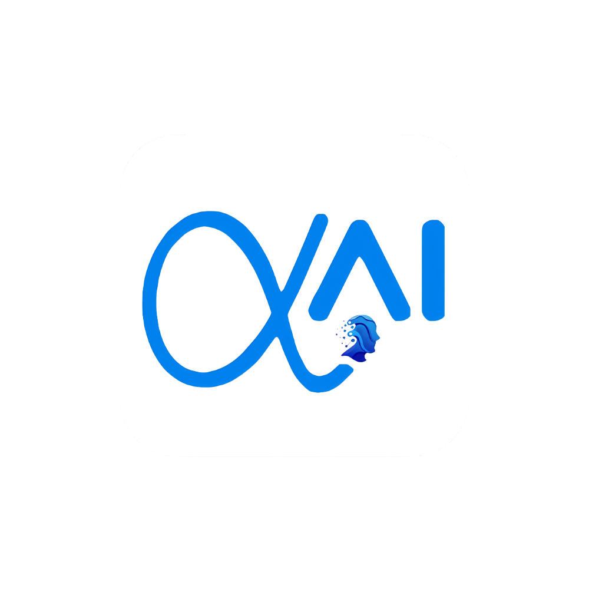

# Book-RAG

<p align="center">
  
</p>

RAG system for book understanding, question answering, summarization, and video generation. Upload a book (PDF/TXT), ingest it into chunks, embed them, store in a vector-enabled datastore, and query with an LLM-backed pipeline.

## Features
- Document ingestion (PDF/TXT)
- Chunking and embeddings
- Vector search via MongoDB + future vector DB integrations
- RAG pipeline (retrieval + generation)
- Summarization and video generation (planned)
- FastAPI backend, Dockerized services

## Architecture
```
[ Book ]
   ↓
[ Text Extraction ]
   ↓
[ Chunking ]
   ↓
[ Embeddings ]
   ↓
[ MongoDB (chunks) / Vector DB ]
   ↓
[ Question ]
   ↓
[ Similarity Search ]
   ↓
[ Context ]
   ↓
[ LLM Answer ]
```

## Tech Stack
- Python 3.12, OOP-first design
- FastAPI (backend)
- MongoDB (chunk storage via Motor)
- LangChain, Sentence-Transformers, Chroma (optional), FAISS (optional)
- Docker & Docker Compose

## Project Structure
```
project/
  Docker/
    Dockerfile
    docker-compose.yml
  data/
  ingestion/
  embeddings/
  vector_db/
    mongo_client.py
  rag/
  summarization/
  video/
  app/
    main.py
    server.py
    settings.py
    messages.py
```

## Prerequisites
- Python 3.12+
- Docker (optional but recommended)

## Environment
Create a `.env` file at the repository root:
```
MONGODB_URI=mongodb://mongo:27017
MONGODB_DB=bookrag
OPENAI_API_KEY=
MISTRAL_API_KEY=
```
- For local (without Docker), you can use `MONGODB_URI=mongodb://localhost:27017`
- `.env` is ignored by git and is loaded automatically by the app and by docker-compose via `env_file`

## Quickstart (Docker)
```
docker compose -f project/Docker/docker-compose.yml up --build
```
- API: http://localhost:8000
- Health: http://localhost:8000/health

## Quickstart (Local Dev)
```
python -m venv .venv
.\.venv\Scripts\Activate.ps1
.\.venv\Scripts\python -m pip install -r requirements.txt
.\.venv\Scripts\python -m uvicorn project.app.main:app --reload
```
- Health: http://localhost:8000/health

## Coding Conventions
- Clean OOP design with classes
- Enumerations for message keys ([messages.py](project/app/messages.py))
- Settings via pydantic-settings, loaded from `.env`

## API
- `GET /health` → service status
- More endpoints will be added for ingestion, chunking, search, and summarization

## Deployment
- Use Docker for consistent environments
- Configure environment variables via `.env` or platform secrets

## License
MIT (or choose a suitable license; update as needed)
